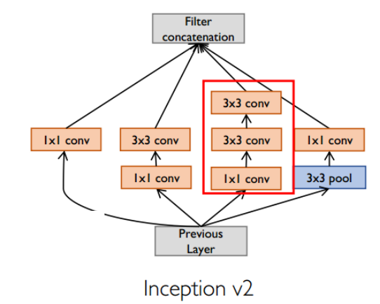
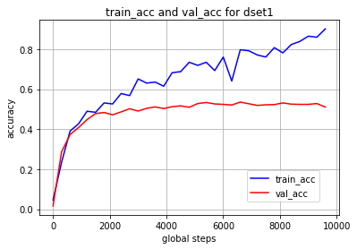
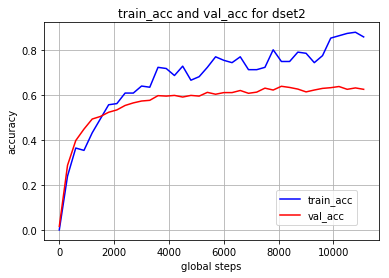

##  作业二：卷积神经网络

by charles 18/05/14 <!-- .element: style="text-align:right;" -->

## 前言

利用TensorFlow（TF），本作业实现了一个基于full convolution stack、inception v2 module等模块的图片分类网络，纵向共包含10层包含参数的层，采用自己搭建的卷积层。对于dset1与dset2采用同样的网络结构，分别进行训练。最终在dset1验证集（约含900张图，下同）上的Top1分类准确率约为0.52，在dset2验证集上的Top1准确率约为0.63。在K80显卡的单核上，该模型的训练速度约为205张图每秒，最终所得模型的checkpoint约为45MB。本报告将从模型搭建、模型训练、测试方法等方面对本作业的工作进行详细说明。

作业所有代码以及训练好的模型存放于hw2\_image\_classification\_handed文件夹中。参考借鉴TensorFlow的利用CNN给CIFAR-10数据集分类的官方教程1，本作业代码的组织结构如下表所示：

|代码文件<!-- .element: style="text-align:left;" -->|功能<!-- .element: style="text-align:left;" -->|
| --- | --- |
| hw2\_dataset.py | 数据集预处理：将给定的数据集随机切分成训练集和验证集 |
| augmentation.py | 图片数据增广：包含缩放、旋转、镜像、偏移、加噪声等函数 |
| hw2\_input.py | 基于TF的QueueRunner，载入训练和测试所需的batch |
| layers.py | 模型中子模块的实现。包括full conv stack, inception\_v1\_module, inception\_v2\_module, 以及卷积层的实现及测试函数。 |
| hw2.py | 实现了模型图生成所用到的train、loss等函数 |
| hw2\_train.py | CPU或单GPU训练的主程序 |
| hw2\_multi\_gpu\_train.py | 多GPU训练的主程序 |
| hw2\_eval.py | 进行模型评估的主程序 |
| utils.py | 新建模型参数的一些辅助函数 |
| config.cfg | 模型配置文件。可以根据代码运行机器（本地或服务器）分别配置不同的运行参数 |

## 模型搭建
### 模型结构

模型计算图的构建由hw2.inference()完成。参考VGG和Inception V2的设计，本作业模型设计的主要思路如下：

1. 采用一些已经被证明非常有效的模块，如VGG中的full conv stack以及Inception中的inception module。模型应当先胖后瘦，输入维度应当适中，既要保证分类所需的足够信息输入，也要考虑模型的复杂性问题。最终conv输出的特征图大小以7x7左右为宜，中间可以利用stride或者pooling进行降采样。
2. 为减小参数量，应当避免使用7x7，5x5这种大卷积核，可以用三个3x3及两个3x3分别对其进行代替，这样即保证了相同的感受野，还加深了模型的深度，也减少了参数量。
3. 采用流行的批正则化方法（BN），有助于降低covariate shift，使得模型的训练速度加快，泛化能力增强。该方法在conv层和dense层都可以使用。
4. 采用dropout缓解过拟合问题。针对每个训练样本，随机让某些隐层单元失活，这样训练每条样本的网络是原先网络的一个简单的子网络，降低了网络的复杂度，减少训练结果的方差。需要注意的是卷积层后不宜采用全连接层常用的普通dropout方法，宜采用spatial dropout，即不是随机丢掉特征图中的某个像素，而是随机丢掉整个特征图。
5. 为使模型训练具有良好的初始点，采用跟激活函数配套的初始化方法对权重进行初始化，如ReLU激活函数对应的HE方法。

基于以上考虑，并经过不断的试验，最终设计了如下表所示的十层网络。

| 名称 | 输入维度 | 输出维度 | 描述 |
| --- | --- | --- | --- |
| conv\_stack1/conv1 | 100x100x3 | 100x100x64 | 采用ReLU激活、带批正则化（BN）的卷积层 |
| conv\_stack1/conv2 | 100x100x64 | 50x50x128 | 采用ReLU激活、带批正则化（BN）的卷积层 |
| pool1 | 50x50x128 | 25x25x128 | 最大池化层 |
| inception2 | 25x25x128 | 25x25x320 | 输出带BN的inception v2 module |
| pool2 | 25x25x320 | 13x13x320 | 最大池化层 |
| dropout2 | 13x13x320 | 13x13x320 | spatial dropout |
| inception3 | 13x13x320 | 13x13x192 | 输出带BN的inception v2 module |
| pool3 | 13x13x192 | 7x7x192 | 最大池化层 |
| dropout3 | 7x7x192 | 7x7x192 | spatial dropout |
| dense1 | 7x7x192 | 256 | 采用ReLU激活、带L2正则化、含BN与dropout的全连接层 |
| softmax\_linear | 256 | 65 | softmax分类器 |

上表中所列举的conv\_stack, inception v2 module均在layers.py中实现。其中inception v2 module具体结构如下图所示。由于采取了的padding方法为same，该模块不会改变输入的WxH，但可能改变其channel数。表中所用的inception层参数如下：
* 对于inception2，从左到右四个tower的输出channel分别为64,96,96,64，合计320，中间两个tower的bottleneck 层（也就是1x1 conv）输出维度为64；
* 对于inception3，从左到右四个tower的输出channel分别为32,64,64,32，合计192，中间两个tower的bottleneck 层（也就是1x1 conv）输出维度为96；

    

### 卷积层的搭建

在layers.py中实现了conv2d\_func(input, filter, strides, padding=&#39;SAME&#39;)及其测试函数conv2d\_test()。conv2d\_func()与tensorflow.python.ops.gen\_nn\_ops.conv2d()等价，通过测试可发现对于相同输入，两者所得运算结果相同。但在输入数据维度很大时存在一定小误差，该误差在可接受范围内。对于实际训练过程，发现conv2d\_func的使用使得训练速度将为原来的一半左右，而训练精度则基本相同。

conv2d\_func的实现借鉴了caffe中卷积层的实现。其主要分为两步，首先调用tf.extract\_image\_patches()得到卷积核在每一步卷积过程中需要做element-wise multiplication的对象，再把这些运算对象和卷积核都reshape成矩阵，调用tf.matmul()进行相乘，最后将结果reshape成相应的维度进行输出。

## 模型训练
### 数据读入

原始数据集被按照4:1的关系随机分成训练集与验证集。模型的数据读入由CPU完成。hw2.distorted\_inputs()负责生成训练所需的batch，hw2. inputs()负责生成测试所需的batch。基本过程如下：程序首先从给定的数据集文件夹中读取所有图片的文件名称及其标签，利用tf.train.slice\_input\_producer()将其加入到TF的QueueRunner中，从该队列中读取图片，进行图片预处理后，将其加入到tf.train.shuffle\_batch()（训练时）或者tf.train.batch()（测试时）所形成的QueueRunner中，训练过程中hw2.train()则可以按需从队列中读训练数据到GPU显存中。对于本次作业的可以一次性全部加载到内存中小数据量而言，这种惰性读取的方法稍显复杂，但对于一般意义上数据集动辄几十上百GB的图片任务来说，这个做法是非常有必要的。

图片数据预处理的过程即为图片数据增广的过程。通过试验可发现数据增广并不是越多越好，关键是要看测试集的数据分布选择合适的增广方法。本作业训练过程中，先将读入的图片保持比例地将短边缩放到260像素，再随机crop出200x200的方框图，经过augmentation.image\_augmentation()的随机左右镜像、随机亮度调整、随机对比度调整后，将图片缩放至100x100（输入两倍大小的图片进行数据增广是为了减少某些增广操作带来的图像失真），再调用tf.image.per\_image\_standardization()进行归一化处理后得到最终待输入的图片。以下三张图从左之后分别展示了原始图片、待数据增广图片和待输入图片。在测试过程中，图片首先仍然保持比例地将短边缩放到260像素，但随后central crop出260x260的图像，再缩放成100x100输入到模型中。

### 训练方法

可通过运行hw2\_train.py或者hw2\_multi\_gpu\_train.py以在单个GPU或者多个GPU上对模型进行训练，其中hw2\_train.py也可用于借助CPU的训练。为实现多GPU训练，模型所有的参数都存放在CPU上，训练时数据batch会送到GPU中，由每个GPU分别计算该batch的梯度，送回到CPU计算平均梯度后进行参数更新，再将新参数送到GPU中进行下一轮计算。该训练方式与采用同步方式进行更新的参数服务器是一样的。实验表明，采用K80的双核心进行训练比采用单核心进行训练的速度要快一倍左右，这表明多GPU、分布式的训练方法在数据量庞大的情况下是极为有用的。

模型的训练采用tf.train.MonitoredTrainingSession()，定制化地实现了\_LoggerHook、\_EarlyStoppingHook、ckpt\_hook等hook，挂到session中以对训练过程进行日志显示、提早结束、模型保存等操作。通过feed\_dict传入模型中三个dropout层的keep\_prob参数，从上游到下游分别为0.75,0.75,0.5。将上游的keep\_prob设置得大一些有助于避免信息损失过多导致模型训练缓慢甚至完全不能收敛的问题。

模型每个batch的大小设置为128，采用tf.train.AdamOptimizer()进行优化，初始学习率lr设置为默认的0.001，通过\_EarlyStoppingHook，如果检测到模型的验证集准确率在连续7\*FLAGS.save\_checkpoint\_steps个batch内都没有得到提升，则AdamOptimizer的初始学习率会将为原来的一半。右图即展现了训练过程中初始学习率的变化过程。如果连续15\*FLAGS.save\_checkpoint\_steps个batch内验证集准确率都没有提升，则模型会提前结束训练，然后取所保存的最好模型作为最终模型。模型参数的更新借助tf.train.ExponentialMovingAverage()，采用滑动平均的方式进行更新，这有助于提高模型的鲁棒性。

    

以下两图展示了对于dset1和dset2在训练过程中train Top1 acc和val Top1 acc的变化曲线。可以看出由于采用了BN、AdamOptimizer等技术，模型初始的收敛很快。由于dropout的加入，模型的训练集准确率在波动中缓慢上升，但后期验证集准确率提升程度已经比较有限。模型最终经过约10000个batch（即约10000\*128/3200=400个epoch）仍然存在一定的过拟合问题。模型最终效果如下：
validation accurary (be done for about 900 samples in validation set):
* for dset1: top1 acc ~ 0.52, top5 acc ~ 0.79
* for dset2: top1 acc ~ 0.63, top5 acc ~ 0.84

## 测试命令
通过使用tf.app.flags.FLAGS、configparser等工具，本作业代码的所有参数既可以通过命令行传入，也可以通过修改congfig.cfg文件传入。若要进行测试，请先进入hw2_image_classification_handed目录，然后输入以下相应的命令：

* 对dset1进行测试：
python hw2_eval.py --eval_dir ./eval_dir --checkpoint_dir ./saved_model/train_log_dset1_handed \
--test_data_path /your/path/to/test_set --num_examples examples_to_run_per_test --top_k 1 --run_once 0
* 对dset2进行测试：
python hw2_eval.py --eval_dir ./eval_dir --checkpoint_dir ./saved_model/train_log_dset2_handed \
--test_data_path /your/path/to/test_set --num_examples examples_to_run_per_test --top_k 1 --run_once 0
在上述命令中，你需要手动指定四个参数： --test_data_path /your/path/to/test_set --num_examples examples_to_run_per_test --top_k 1 --run_once 0

具体说明如下：
The hw2_eval.py will fetch randomly --num_examples images in --test_data_path using tf.train.batch() for a single test and return the --top_k error, this procedure will repeat if --run_once is set 0 (and don't repeat if it's set to 1). 

Attention: it's recommended to set --num_examples as big as your test set to get a consistent test result!

举例来说，对于dset1的测试可运行以下命令：
python hw2_eval.py --section ecm --eval_dir ./eval_dir --checkpoint_dir ./saved_model/train_log_dset1_handed \
--test_data_path /scratch/xzou/hw2_image_classification/modified_data/dset1/test --num_examples 900 --top_k 1 --run_once 0

## 总结

经过一系列的模型结构优化、参数调试，所提模型在dset1上的Top1 acc由最初的0.16左右提高到了最终的0.53左右，模型的规模由最大的900MB左右降低到了最终的45MB，层数由最多时的22层降低到了最终的10层。现将相关经验总结如下：

1. 首先要搭建起一个过拟合的模型，再来解决过拟合问题。本作业采取的解决过拟合的主要手段有：
  1. 数据增广。采用了随机crop、随机左右镜像、随机对比度调整、随机亮度调整。需要注意的是，与测试集的数据分布相悖的数据增广很可能会使得模型表现得更差，因此需要通过分析、实验确定合适的增广手段，切不可盲目以为增广手段越多越好。在本作业中可观察到旋转变化的加入会严重影响模型性能。
  2. 模型简化。做法是一步步地不断降低模型的深度与宽度，直到观察到训练精度有较大损失为止。这样做可以降低过拟合风险，并且降低计算负担。
  3. Dropout。当加在卷积层后时宜采用spatial dropout方法，为避免信息损失过大，宜对上游的dropout层设置较大的keep\_prob。
  4. Batch Normalization（BN）。其有助于降低covariate shift，使得模型的训练速度加快，泛化能力增强。该方法在conv层和dense层都可以使用。采用BN所带来的性能提升远比采用dropout带来的提升要多！
  5. 对dense层参数进行L2正则化。
  6. 采用HE方法对参数进行初始化。
2. Batch Size也是一个影响模型性能的重要超参数。小batch可以使得梯度产生更多随机性，使其不容易陷入局部极值点，但有时不能充分发挥出显卡的的计算性能；大batch则容易使模型陷入局部极值点。有研究2表明较小的batch能获得更好的效果。也有研究者喜欢训练前期采用较小的batch，后期再改用大batch。
3. 预处理阶段对图片进行缩放时，采用等比例缩放比采用正方形缩放效果要稍微好一些。
4. 深度学习框架所内置的卷积等操作是利用Cudnn等计算库进行了深度优化的，其性能一般要比自己实现的好上好几倍。如本作业中自己实现的卷积层速度仅为原生函数的一半左右。
5. 本作业所给的两个数据集具有一定的相似性，若要进一步提高模型的性能，应该考虑从多任务学习、迁移学习入手。

